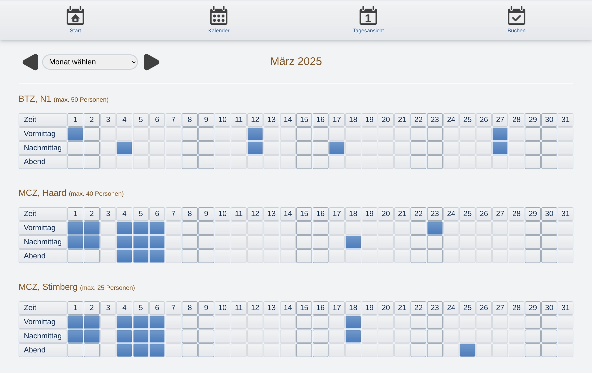
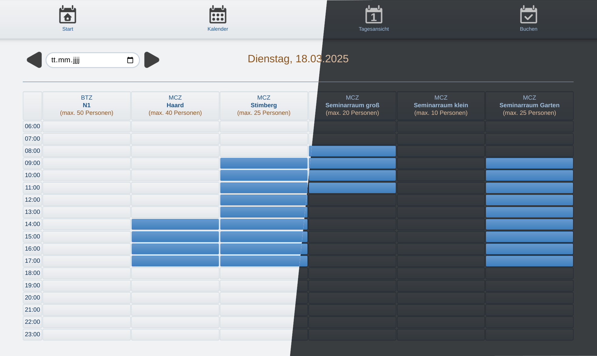

# bookit

Room booking tool for conferences or education including catering options
----

**bookit** is a web based javascript application that can be used to administer the room booking management for one or multiple locations. The GUI language is German.

**Features**:

- A simple, and easy to understand user interface providing a **self-explanatory user experience**

- **Calendar view** displaying all available rooms and locations for a selected month and indicating already booked time slots. Weekends are highlighted and a hover tooltip provides basic information about the selected booking.

- **One day view** displaying all available rooms and locations for one selected day providing a more detailed time schedule.

- Clicking a free time slot automatically renders a **prefilled booking form** with date, time, and room already selected. An intelligent **room managing** guarantees that no room can be booked twice at the same time.
  **Catering** can be booked along with the room(s).
  **Costs** are displayed and updated during the booking process.
  Multiple **input checks** prevent bookings from being saved without all the necessary data.

- **Adim tools** providing
  
  - Adding, editing, or deleting rooms
  
  - Adding, editing, or deleting catering articles
  
  - Adding, editing, or deleting room equipment like flip charts etc.
  
  - Adding, editing, or deleting various offered seatings
  
  - Resetting passwords
  
  - CSV data export for all bookings, including past and cancelled bookings

- Light and **dark mode**

## Licence

The source code of this application is free to use and was published under the MIT licence. [Code available on Github]([GitHub - fab-log/bookit: Booking tool for conferences or education including catering options](https://github.com/fab-log/bookit/tree/main)).

## Documentation

Current version: 1.0.0

#### Security

The application does not provide a full user management. Though, regular users and administrators do need passwords to access the app. The password is encrypted before being stored on the server. 

The initial password (user and admin) after installation is set to `321321321`.

Be cautious when passing the password to new users or admins and update the passwords regularly.

#### Installation

To install the application locally, the following steps are required.

Prerequisites: **node.js** needs to be installed on your device.

1. Copy or clone this repository to your machine.
2. Decompress, if necessary.
3. Store all files in an app directory of your choice.
4. In a command line terminal, navigate to your app directory.
5. Run `npm init` to initialize the project.
6. Run `npm i` to install dependencies (only *express* and *nodemailer* are required).
7. Run `node server.js` to start the application. If you prefer a developer context you can run `nodemon start` instead. In that case an installation of *nodemon* is required.
8. Open a browser window an type `localhost:8004/` to the address bar.

#### API

The API uses the *json* middleware. Most of the transmitted data is provided as an object including a *status* and a *data* key.

**Routes**

| endpoint                    | type |
| --------------------------- | ---- |
| /bookit.loginUser           | post |
| /bookit.updateUserPassword  | post |
| /bookit.loginAdmin          | post |
| /bookit.updateAdminPassword | post |
| /bookit.getRooms            | get  |
| /bookit.updateRooms         | post |
| /bookit.getCatering         | get  |
| /bookit.updateCatering      | post |
| /bookit.getSeatings         | get  |
| /bookit.updateSeatings      | post |
| /bookit.getFees             | get  |
| /bookit.updateFees          | post |
| /bookit.getEquipment        | get  |
| /bookit.updateEquipment     | post |
| /bookit.getBookings         | get  |
| /bookit.newBooking          | post |
| /bookit.updateBookings      | post |
