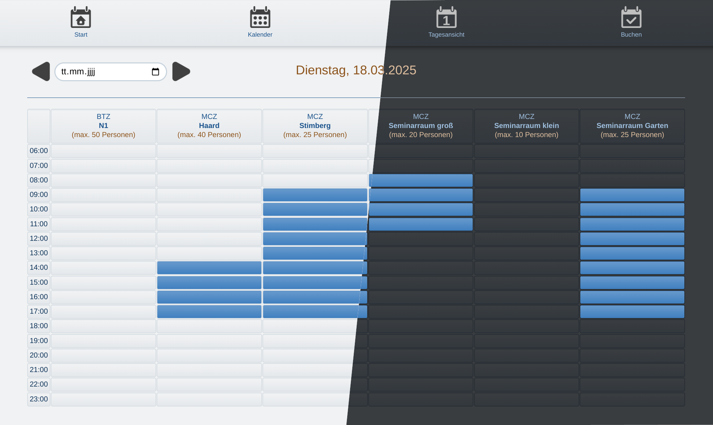

Raumbuchungstool für Konferenzen oder Schulungen einschließlich Catering-Optionen
----

**bookit** ist eine webbasierte JavaScript-Anwendung, die zur Verwaltung des Raumbuchungsmanagements für einen oder mehrere Standorte verwendet werden kann. Die GUI-Sprache ist Deutsch.

**Funktionen**:

- Eine einfache und leicht verständliche Oberfläche, die eine **selbsterklärende Benutzererfahrung** bietet.

- **Kalenderansicht**, die alle verfügbaren Räume und Standorte für einen ausgewählten Monat anzeigt und bereits gebuchte Zeitfenster kennzeichnet. Wochenenden sind hervorgehoben und ein Hover-Tooltip bietet grundlegende Informationen zur ausgewählten Buchung.

- **Tagesansicht**, die alle verfügbaren Räume und Standorte für einen ausgewählten Tag anzeigt und einen detaillierteren Zeitplan bietet.

- Ein Klick auf ein freies Zeitfenster erzeugt automatisch ein **vorgefülltes Buchungsformular** mit bereits ausgewähltem Datum, Uhrzeit und Raum. Eine intelligente **Raumverwaltung** garantiert, dass kein Raum doppelt gebucht werden kann. 
  Mit der Raumbuchung kann gleichzeitig **Catering** gebucht werden. 
  Entstehende **Kosten** werden während des Buchungsprozesses angezeigt und aktualisiert. 
  Mehrere **Eingabekontrollen** verhindern, dass Buchungen ohne alle erforderlichen Daten gespeichert werden.

- **Admin-Tools**, mit folgenden Möglichkeiten:
  
  - Hinzufügen, Bearbeiten oder Löschen von Räumen
  
  - Hinzufügen, Bearbeiten oder Löschen von Catering-Artikeln
  
  - Hinzufügen, Bearbeiten oder Löschen von Raumausstattungen wie Flipcharts usw.
  
  - Hinzufügen, Bearbeiten oder Löschen von verschiedenen angebotenen Sitzplätzen
  
  - Zurücksetzen von Passwörtern
  
  - CSV-Datenexport für alle Buchungen, einschließlich vergangener und stornierter Buchungen

- Heller und **dunkler Modus**

## Lizenz

Der Quellcode dieser Anwendung ist kostenlos nutzbar und wurde unter der MIT-Lizenz veröffentlicht. [Code verfügbar auf Github]([GitHub - fab-log/bookit: Buchungstool für Konferenzen oder Schulungen einschließlich Catering-Optionen](https://github.com/fab-log/bookit/tree/main)).

## Dokumentation

Aktuelle Version: 1.0.0

#### Sicherheit

Die Anwendung bietet kein umfassendes Benutzermanagement. Dennoch benötigen reguläre Benutzer und Administratoren Passwörter, um auf die App zuzugreifen. Das Passwort wird vor der Speicherung auf dem Server verschlüsselt.

Das initiale Passwort (Nutzer wie Administrator) nach der Installation lautet `321321321`.

Seien Sie vorsichtig, wenn Sie das Passwort an neue Benutzer oder Administratoren weitergeben, und aktualisieren Sie die Passwörter regelmäßig.

#### Installation

Um die Anwendung lokal zu installieren, sind die folgenden Schritte erforderlich.

Voraussetzungen: **node.js** muss auf Ihrem Gerät installiert sein.

1. Kopieren oder klonen Sie dieses Repository auf Ihren Computer.
2. Dekomprimieren Sie es, falls erforderlich.
3. Speichern Sie alle Dateien in einem Verzeichnis Ihrer Wahl.
4. Navigieren Sie in einem Befehlszeilen-Terminal zu Ihrem Anwendungsverzeichnis.
5. Führen Sie `npm init` aus, um das Projekt zu initialisieren.
6. Führen Sie `npm i` aus, um Abhängigkeiten zu installieren (nur *express* und *nodemailer* sind erforderlich).
7. Führen Sie `node server.js` aus, um die Anwendung zu starten. Wenn Sie einen Entwicklerkontext bevorzugen, können Sie stattdessen `nodemon start` ausführen. In diesem Fall ist eine Installation von *nodemon* erforderlich.
8. Öffnen Sie ein Browserfenster und geben Sie `localhost:8004/` in die Adresszeile ein.

#### API

Die API verwendet die *json*-Middleware. Die meisten der übermittelten Daten werden als Objekte bereitgestellt, die einen *status* und einen *data*-Schlüssel enthalten.

**Routen**

| Endpunkt                    | Typ  |
| --------------------------- | ---- |
| /bookit.loginUser           | post |
| /bookit.updateUserPassword  | post |
| /bookit.loginAdmin          | post |
| /bookit.updateAdminPassword | post |
| /bookit.getRooms            | get  |
| /bookit.updateRooms         | post |
| /bookit.getCatering         | get  |
| /bookit.updateCatering      | post |
| /bookit                     |      |
